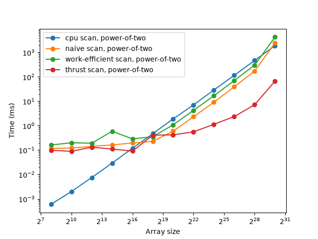
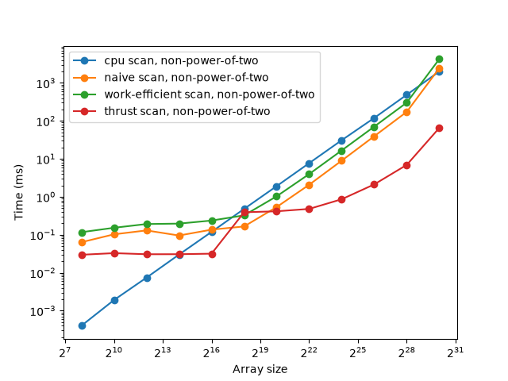
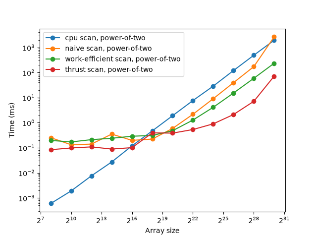

CUDA Stream Compaction
======================

**University of Pennsylvania, CIS 565: GPU Programming and Architecture, Project 2**

* Ryan Morris
  * [LinkedIn](www.linkedin.com/in/r19)
* Tested on: Windows 11, Intel i7-12700H @ 2.3GHz 64GB, GeForce RTX 3070 Ti Laptop GPU 8GB

### Project Description

This project is a CUDA parallel stream compaction algorithm. Below, we compare the performance of the CPU implementation, naive parallel implementation, and effecient parallel implementation.

### Performance Discussion

1. Block Size Optimization

* For both naive and efficient GPU implementations, I tested block sizes ranging from 128 to 1024. There was a lot of variance in the results, but for the Naive implementation a block size of 512 consistently worked the best on our tests and for the efficient implementation slightly smaller block sizes (in this case 256) worked best on the test.

<table>
  <tr>
    <th rowspan="2">Implementation</th>
    <th rowspan="2">Block Size</th>
    <th colspan="2">Power of Two</th>
    <th colspan="2">Non-Power of Two</th>
  </tr>
  <tr>
    <th>Test 1</th><th>Test 2</th><th>Test 1</th><th>Test 2</th>
  </tr>
  <tr><td>Naive</td><td>128</td><td>0.1189</td><td>0.2488</td><td>0.06554</td><td>0.1403</td></tr>
  <tr><td>Naive</td><td>256</td><td>0.1159</td><td>0.1219</td><td>0.0952</td><td>0.0788</td></tr>
  <tr><td><b>Naive</b></td><td><b>512</b></td><td><b>0.1055</b></td><td><b>0.1065</b></td><td><b>0.0963</b></td><td><b>0.0748</b></td></tr>
  <tr><td>Naive</td><td>1024</td><td>0.1055</td><td>0.1629</td><td>0.0901</td><td>0.08813</td></tr>
  <tr><td>Efficient</td><td>128</td><td>0.1741</td><td>0.1546</td><td>0.1085</td><td>0.1014</td></tr>
  <tr><td><b>Efficient</b></td><td><b>256</b></td><td><b>0.1638</b></td><td><b>0.1577</b></td><td><b>0.1884</b></td><td><b>0.0963</b></td></tr>
  <tr><td>Efficient</td><td>512</td><td>0.1393</td><td>0.1690</td><td>0.1198</td><td>0.1055</td></tr>
  <tr><td>Efficient</td><td>1024</td><td>0.2030</td><td>0.1649</td><td>0.1106</td><td>0.1024</td></tr>
</table>

2. Comparison of GPU Scan implementations


**Runtime vs. Number of elements in scan array for initial implementations**

<p align="center">
  
  
</p>

*Note: Block sizes are set as per the bolded rows in the above block size optimization chart, naive=512, efficient=256*

There are two interesting observations from the above measurements. Firstly, it makes sense that the CPU runtime is roughly linear with respect to the number of elements scanned. The CPU requires proportionally more clock cycles to get through all of the elements. At low array sizes, there is a lot of overhead of copying between the host and device and kernel invocations, which lead to the CPU outperforming the GPU implementations. 

You would expect, however, that at larger array sizes the efficient scan would do better. In my measurement, the effecient scan performs worse than the naive scan even, and with the same asymptotic performance as the CPU implementation. This is because of the modulo checks and the fact that for the each of the logN kernel invocations, we have not retired any threads (we are still using all of them). Even with the benefit of GPU parallelization, we are still limited by a fixed number of GPU cores, which is shown in the fixed gap between the GPU performance (green and orange lines) vs. the CPU performance (blue line) which is the worst at higher array sizes.

As an improvement on the initial code, I implemented a small compaction where less total threads are called on each lower level, and the threads are compacted on the left side of the array. That resulted in the following improved performance graph (shown for powers of two below).

<p align="center">
  
</p>

Now, as expected, the early retirement of threads in the efficient version pays off, and it is more performant than both the naive scan and the CPU scan. 

What are the bottlenecks? The CPU version is clearly compute and memory bandwidth bound, and thus scales linearly with N. As mentioned above, the GPU scans are bounded by kernel launch and I/O to device at small N but then by computation at large N, similar to CPU but with a fixed performance boost.

The thrust solution, on the other hand, generally performs much better than my solutions at higher array sizes. 


3. Program Output (final implementation)'

```
****************
** SCAN TESTS **
****************
    [  31  23  48  23  45   4  34  34   8  35  48  12  36 ...  43   0 ]
==== cpu scan, power-of-two ====
   elapsed time: 0.0005ms    (std::chrono Measured)
    [   0  31  54 102 125 170 174 208 242 250 285 333 345 ... 6463 6506 ]
==== cpu scan, non-power-of-two ====
   elapsed time: 0.0005ms    (std::chrono Measured)
    [   0  31  54 102 125 170 174 208 242 250 285 333 345 ... 6421 6460 ]
    passed
==== naive scan, power-of-two ====
   elapsed time: 0.251008ms    (CUDA Measured)
    passed
==== naive scan, non-power-of-two ====
   elapsed time: 0.074752ms    (CUDA Measured)
    passed
==== work-efficient scan, power-of-two ====
   elapsed time: 0.147456ms    (CUDA Measured)
    passed
==== work-efficient scan, non-power-of-two ====
   elapsed time: 0.108544ms    (CUDA Measured)
    passed
==== thrust scan, power-of-two ====
   elapsed time: 0.086016ms    (CUDA Measured)
    passed
==== thrust scan, non-power-of-two ====
   elapsed time: 0.028832ms    (CUDA Measured)
    passed

*****************************
** STREAM COMPACTION TESTS **
*****************************
    [   1   1   2   3   1   2   0   0   2   3   2   0   2 ...   1   0 ]
==== cpu compact without scan, power-of-two ====
   elapsed time: 0.0007ms    (std::chrono Measured)
    [   1   1   2   3   1   2   2   3   2   2   1   3   1 ...   1   1 ]
    passed
==== cpu compact without scan, non-power-of-two ====
   elapsed time: 0.0008ms    (std::chrono Measured)
    [   1   1   2   3   1   2   2   3   2   2   1   3   1 ...   1   2 ]
    passed
==== cpu compact with scan ====
   elapsed time: 0.0016ms    (std::chrono Measured)
    [   1   1   2   3   1   2   2   3   2   2   1   3   1 ...   1   1 ]
    passed
==== work-efficient compact, power-of-two ====
   elapsed time: 0.381952ms    (CUDA Measured)
    passed
==== work-efficient compact, non-power-of-two ====
   elapsed time: 0.125952ms    (CUDA Measured)
    passed

```


### Extra Credit


Include analysis, etc. (Remember, this is public, so don't put
anything here that you don't want to share with the world.)

